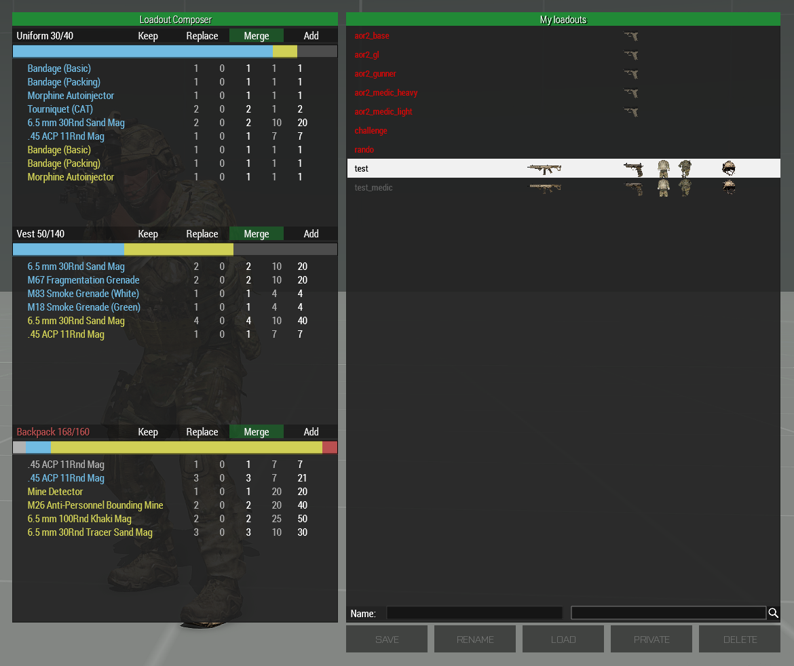

# Loadout Composer

Loadout Composer is an addition to teh ACE arsenal, that allows selective loading 
of  saved loadouts. For example, you might want to load only the contents of a 
loadout's backpack too your current loadout, without changing anything to the rest.

# How to use

* Open the ACE Arsenal.
* In the bottom right corner click the "Loadout Composer" button.

Switching to the Loadout Composer UI will disable certain functionnalities of the 
original ACE loader. To reset the behaviour to normal, escape to the arsnal's main 
screen view and open the loadouts menu again.
